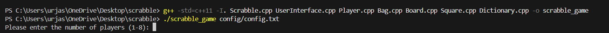
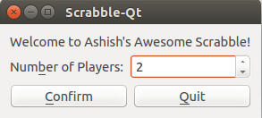
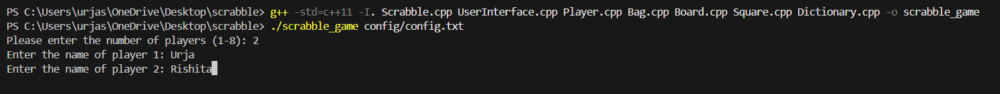
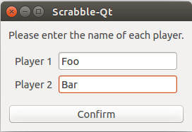
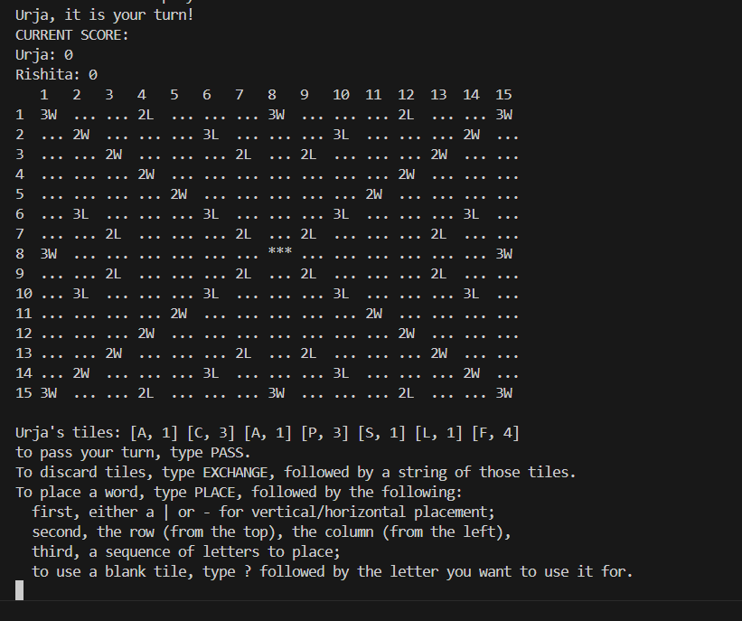
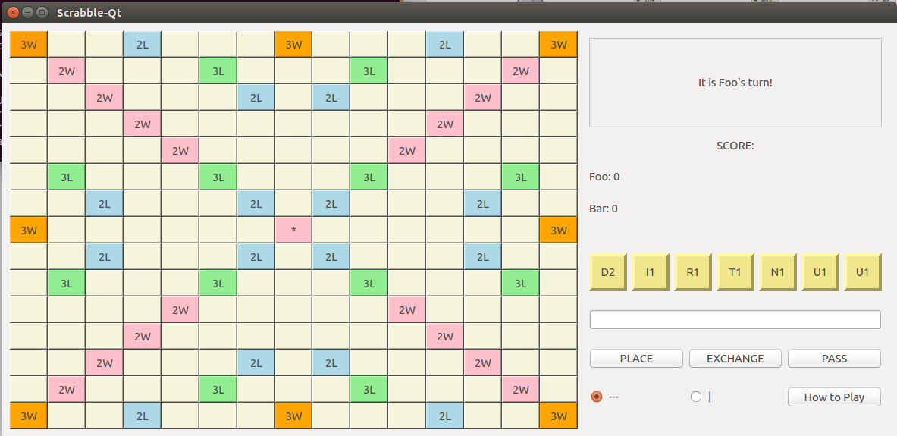
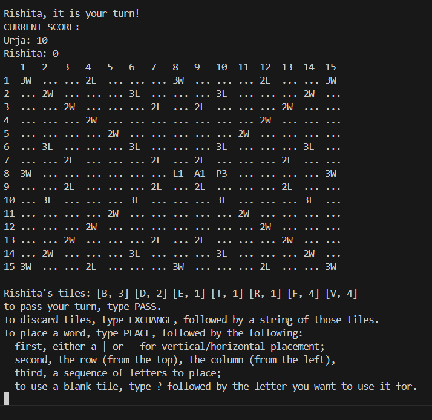
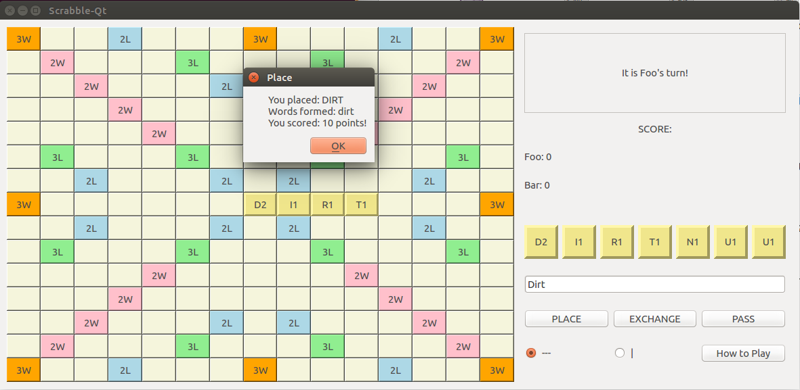
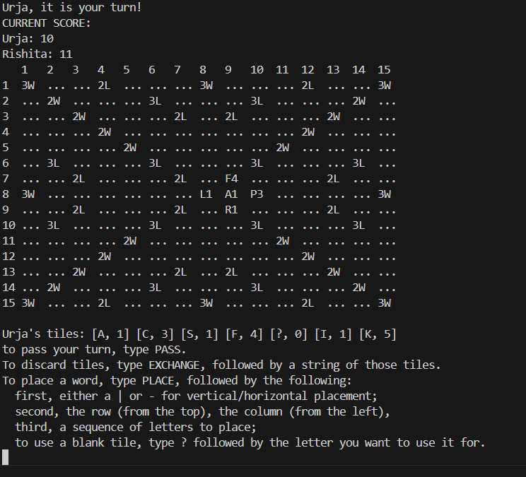
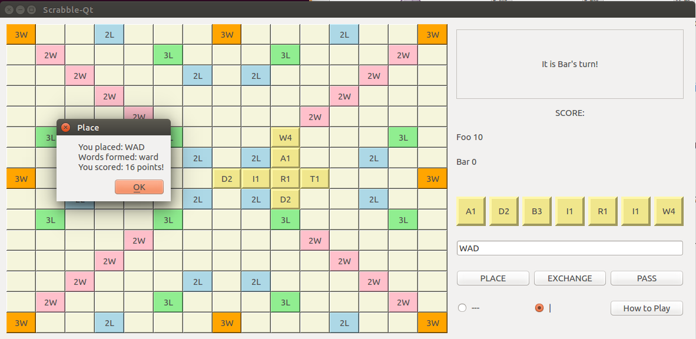

# OPEN SOURCE PROJECT:
# SCRABBLE GAME
### Repository Link: https://github.com/ashishkeshan/Scrabble
### Made with C++ | CLI Version

---
<!-- Slide 2: About the game -->

## 🔍 Project Overview
- A text-based Scrabble game brought to life in C++
- Turn-based play — just like the real thing
- Words validated using a built-in English dictionary file
- Classic tile scoring system implemented with precision
- Interactive board displayed right in your terminal!

---

## 🎯 Objectives
- Understand code structure and flow
- Learn from an open-source C++ project
- Analyze data structures and OOPS principles 
- Identify areas of improvement

---
## ★ Key Data Structures

- **`std::vector`**  
  Used for dynamic arrays like the grid, tile list, and player hands.  
  ✅ **Why?** It offers dynamic resizing, fast access by index, and is easy to iterate over — ideal for managing changing game elements like tiles.
- **`std::map`**  
  Used to map letters to their point values.  
  ✅ **Why?** Provides fast lookups and automatic sorting, which makes score calculation efficient and easy to manage.
- **`std::string`**  
  Used for word handling, player names, and file paths.  
  ✅ **Why?** It's a flexible and built-in way to manage text data, which is central to any word-based game.

---
- **File I/O**  
  Used for dictionary lookups and saving/loading game state.  
  ✅ **Why?** Enables persistent data storage, like valid word lists and game progress, making the game more functional and realistic.

---

## 📦 Project Structure & Modeling

```plaintext
📁 Scrabble
├── Scrabble.cpp           # Main file
├── Makefile               # Build script
├── .gitignore
├── README.md              # Project overview

├── 📁 config               # Game settings
│   └── config.txt

├── 📁 images               # Demo images

├── 📁 lib                  # Header files (class declarations)
│   ├── Bag.h, Board.h, Dictionary.h
│   ├── Player.h, Square.h, Tile.h
│   └── UserInterface.h

├── 📁 src                  # Source files (implementations)
│   ├── Bag.cpp, Board.cpp, Dictionary.cpp
│   ├── Player.cpp, Square.cpp, Tile.cpp
│   └── UserInterface.cpp

├── 📁 bin                  # Compiled files (optional)

```
---

## 🔑 Main Source files and Their Roles

## 1. `Bag`

- **Purpose**:Manages the collection of tiles available for drawing during the game

- **Key Members**:
  - `_tiles`:A `std::vector<Tile*>` storing pointers to tile objects

- **Key Methods**:
  - `addTile(Tile* tile)`:Adds a single tile to the bag and shuffles it
  - `addTiles(std::vector<Tile*> tiles)`:Adds multiple tiles to the bag
  - `drawTiles(int number)`:Draws a specified number of tiles from the bag
  - `tilesRemaining()`:Returns the count of remaining tiles in the bag
---
## 2. `Board`

- **Purpose**:Represents the game board, managing tile placements and validations

- **Key Members**:
  -A 2D grid structure, likely implemented using `std::vector<std::vector<Square>>`, to represent the board layout

- **Key Methods**:
  - `placeTile(Tile* tile, int x, int y)`:Places a tile at the specified coordinates
  - `isValidMove(...)`:Validates whether a move conforms to game rules
  - `calculateScore(...)`:Calculates the score for a given move

---
## 3. `Dictionary`

- **Purpose**:Handles word validation against a predefined list of acceptable words

- **Key Members**:
  -A data structure (e.g., `std::set<std::string>`) to store valid words for quick lookup

- **Key Methods**:
  - `isValidWord(const std::string& word)`:Checks if a word exists in the dictionary
  - `loadFromFile(const std::string& filename)`:Loads words from a file into the dictionary
---
## 4. `Player`

- **Purpose**:Represents a game participant, managing their tiles and score

- **Key Members**:
  - `name`:The player's name
  - `score`:The player's current score
  - `hand`:A collection (e.g., `std::vector<Tile*>`) representing the player's current tiles

- **Key Methods**:
  - `playWord(...)`:Handles the logic for playing a word on the board
  - `drawTiles(Bag& bag)`:Draws tiles from the bag to replenish the player's hand

---
### 5. `Tile`

- **Purpose**:Represents an individual letter tile with an associated point value

- **Key Members**:
  - `letter`:The character on the tile
  - `points`:The point value of the tile

- **Key Methods**:
  - `getLetter()`:Returns the tile's letter
  - `getPoints()`:Returns the tile's point value
---
### 6. `Square`

- **Purpose**:Represents a single square on the game board, which may have special scoring rules

- **Key Members**:
  - `tile`:Pointer to the tile placed on the square, if any
  - `multiplier`:Indicates if the square has a letter or word multiplier

- **Key Methods**:
  - `placeTile(Tile* tile)`:Places a tile on the square
  - `isOccupied()`:Checks if the square already has a tile

---
### 7. `UserInterface`

- **Purpose**:Manages interactions between the game and the user, handling input and output

- **Key Methods**:
  - `displayBoard(const Board& board)`:Renders the current state of the board
  - `getPlayerMove 

---

# 🎯 All About the Game
### Objective: 
Form valid English words on a 15×15 board to score the highest points.

### Tiles:
Each player starts with 7 letter tiles.

There are 100 total tiles including blank (wildcard) tiles.

### Gameplay:
✔ Players take turns placing words on the board, connecting to existing ones.

✔ The first word must cover the center star square.

✔ After placing a word, the player draws tiles to refill their hand to 7.

---
### Scoring:

✔ Each letter has a specific point value.

✔ Special board squares give bonuses:

→ Double/Triple Letter Score

→ Double/Triple Word Score

✔ Using all 7 tiles in one move gives a 50-point bonus.

### Game End:

✔ The game ends when all tiles are used and a player empties their hand, or all players pass.

✔ The highest-scoring player wins

---
# 🧠 Scrabble Code Breakdown 
## ★ Header Files and Libraries – Foundation of the Game

<div class="code-container fragment">
  
  <div class="code-block">
  
  

```cpp
#include <iostream>     // Console I/O
#include <fstream>      // File I/O
#include <sstream>      // String streams
#include <string>       // String operations
#include <cstdlib>      // General utilities
#include <stdexcept>    // Exception handling
#include <vector>       // Dynamic arrays

#include "Dictionary.h"     // Word validation
#include "Board.h"          // Board state
#include "Tile.h"           // Tile representation
#include "Player.h"         // Player data
#include "Bag.h"            // Tile bag mechanics
#include "Square.h"         // Board squares
```
---
# ⚖️ Trade-Offs in C++ Scrabble Game

- The game uses a **console-based design**, prioritizing simplicity and portability over the visual appeal and modern features that a GUI could provide.
  
- An **object-oriented design** is implemented, which improves code modularity and maintainability but adds some complexity compared to a simpler procedural approach.

- The game supports **multiplayer**, allowing for more dynamic gameplay, but does not include a **single-player AI** for solo players.

- A **file-based dictionary** is used to check valid words, providing a straightforward implementation, but it is not as efficient as more advanced data structures like tries or hash tables.

- **Automated testing** is not implemented, allowing for faster development but increasing the risk of bugs and making the code harder to maintain as the project expands.

---
# ★  GAME DEMO
## Player Selection

<div style="display: flex; justify-content: space-around; align-items: center;">

  <div style="text-align: center;">
    <strong>Game Running on My Computer</strong><br>
    
  </div>

  <div style="text-align: center;">
    <strong>Scrabble GUI (Qt Interface)</strong><br>
    
  </div>

</div>

---
## Player Naming

<div style="display: flex; justify-content: space-around; align-items: center;">

  <div style="text-align: center;">
    <strong>Game Running on My Computer</strong><br>
    
  </div>

  <div style="text-align: center;">
    <strong>Scrabble GUI (Qt Interface)</strong><br>
    
  </div>

</div>

---
## First Turn of Player 1

<div style="display: flex; justify-content: space-around; align-items: center;">

  <div style="text-align: center;">
    <strong>Game Running on My Computer</strong><br>
    
  </div>

  <div style="text-align: center;">
    <strong>Scrabble GUI (Qt Interface)</strong><br>
    
  </div>

---
## After First turn

<div style="display: flex; justify-content: space-around; align-items: center;">

  <div style="text-align: center;">
    <strong>Game Running on My Computer</strong><br>
    
  </div>

  <div style="text-align: center;">
    <strong>Scrabble GUI (Qt Interface)</strong><br>
    
  </div>

---
## After First turn of Player 2

<div style="display: flex; justify-content: space-around; align-items: center;">

  <div style="text-align: center;">
    <strong>Game Running on My Computer</strong><br>
    
  </div>

  <div style="text-align: center;">
    <strong>Scrabble GUI (Qt Interface)</strong><br>
    
  </div>

---

# ★ QUESTIONS

**Q1. Can you make this game in other languages?**

A1. Yes, the Scrabble game can definitely be adapted to other human languages like Spanish, Hindi, or German. However, it would require modifying the letter tiles, point values, and dictionary used for word validation to match the rules and vocabulary of each language. The current project on GitHub is in English, but with some changes to the data files and logic, it can support multiple languages

---

**Q2. How is the dictionary integrated for word validation?**

A2. The dictionary is loaded from a text file (words.txt). Each word is validated by checking if it exists in the dictionary. The game uses the Dictionary class to load the file and store valid words in a std::set for fast lookup during word validation.

---
Q3. **Since this is an open-source project, how do we plan to maintain and extend it in the future?**  

A3. **Some improvements we could implement are:**

🟢 **Add a "Restart Game" feature** to let players quickly begin a new game without relaunching the program.

🟢 **Introduce online multiplayer support**, allowing users to host or join games with friends over the internet.

🟢 **Implement a game-saving and loading system**, so players can pause and resume gameplay at their convenience.

🟢 **Add sound effects and background music** for a more engaging and interactive gaming experience.

🟢 **Add a tutorial or help section** to guide first-time players on how to play the game and understand the rules.

---

**Q4. In the current Scrabble code, how would you modify the Player class to track the history of all moves made by a player during the game? What data structures would you use, and how would you display this history at the end of the game?**

A4. Steps to Track and Display Move History
1. Add a container in the Player class to store each move a player makes.
✅ Data Structure Used: std::vector<std::string>

2. Create a method to record a move by appending it to the vector.

3. Invoke this method in the game loop each time a player inputs a move.

4. At the end of the game, iterate over the vector for each player to display their move history.

---
**Q5. How does your project utilize OOP principles?**

A5. OOPS principles:
🟢 **Encapsulation:** Each component (e.g., Tile, Board, Player) is implemented as a separate class with its own data and methods.

🟢 **Abstraction:** Complex logic (e.g., word validation in Dictionary, tile drawing in Bag) is hidden behind simple interfaces.

🟢 **Modularity:** Classes are organized in separate files for easier maintenance and scalability.


---
# THANK YOU
